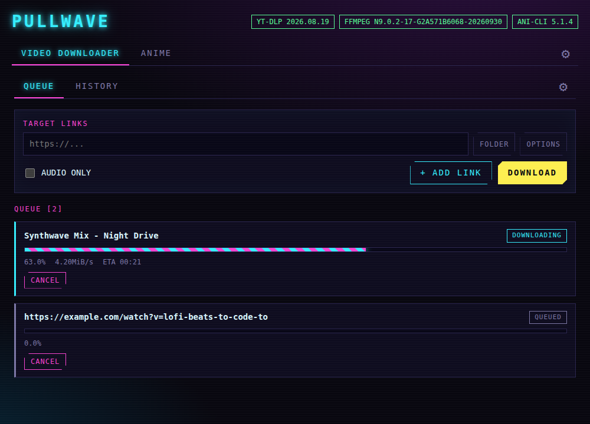
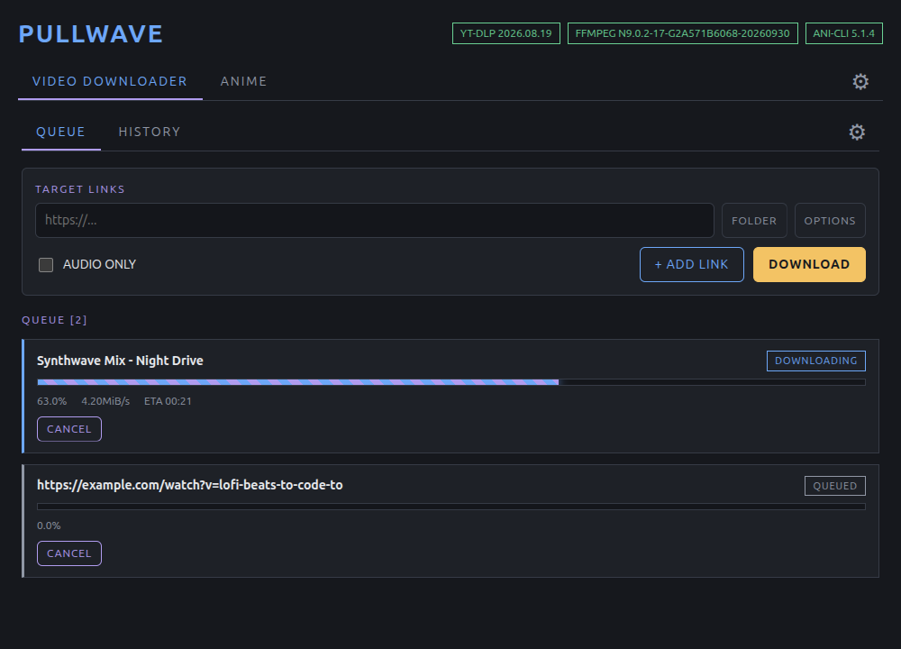
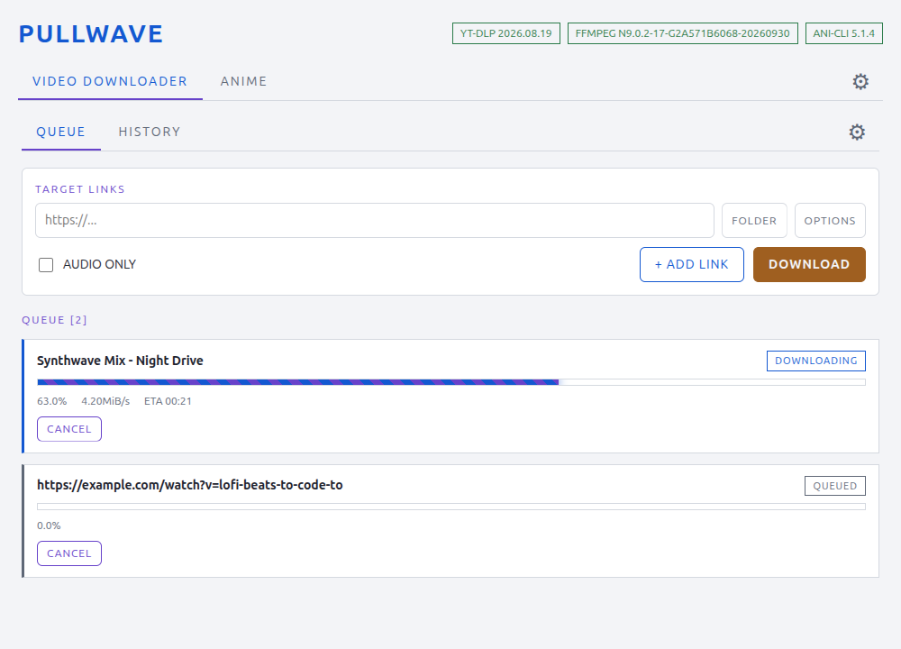
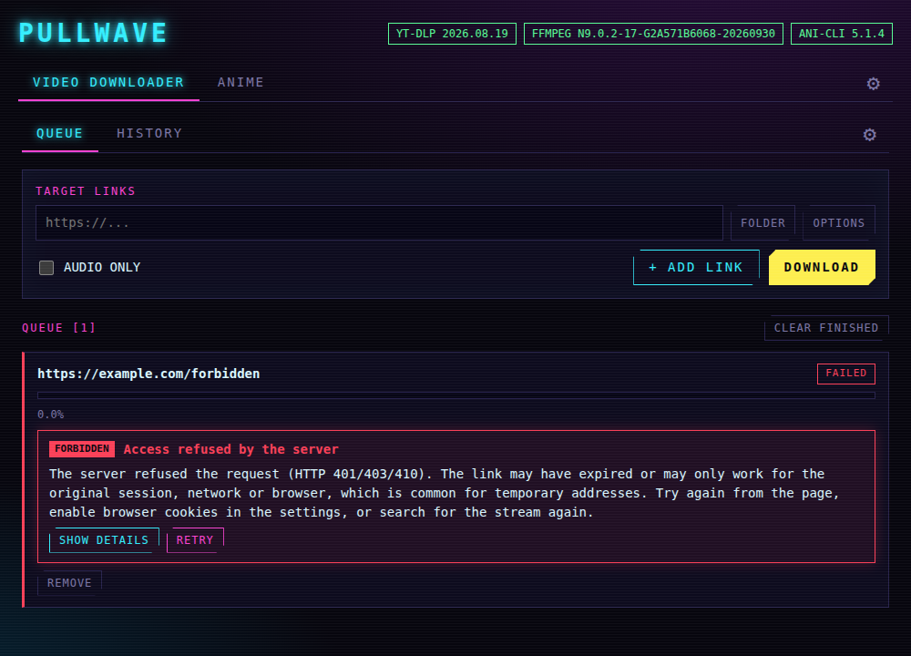
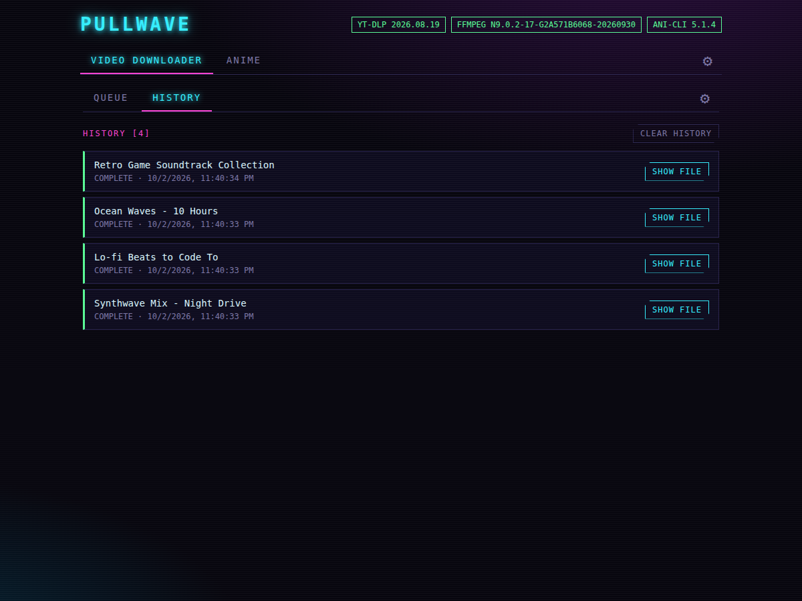
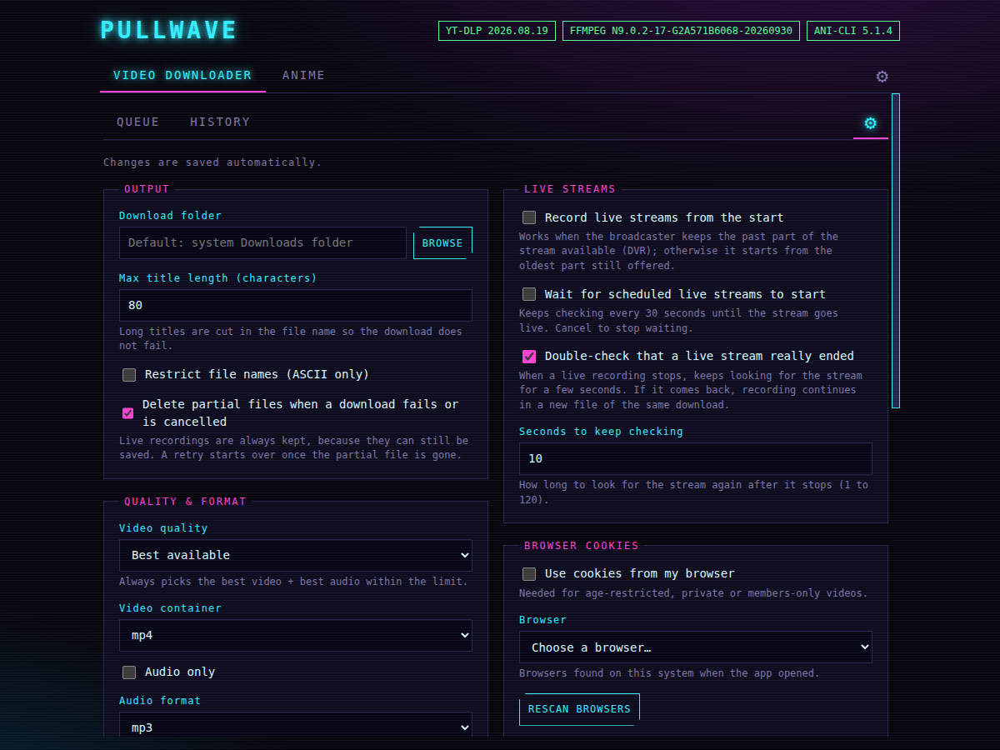
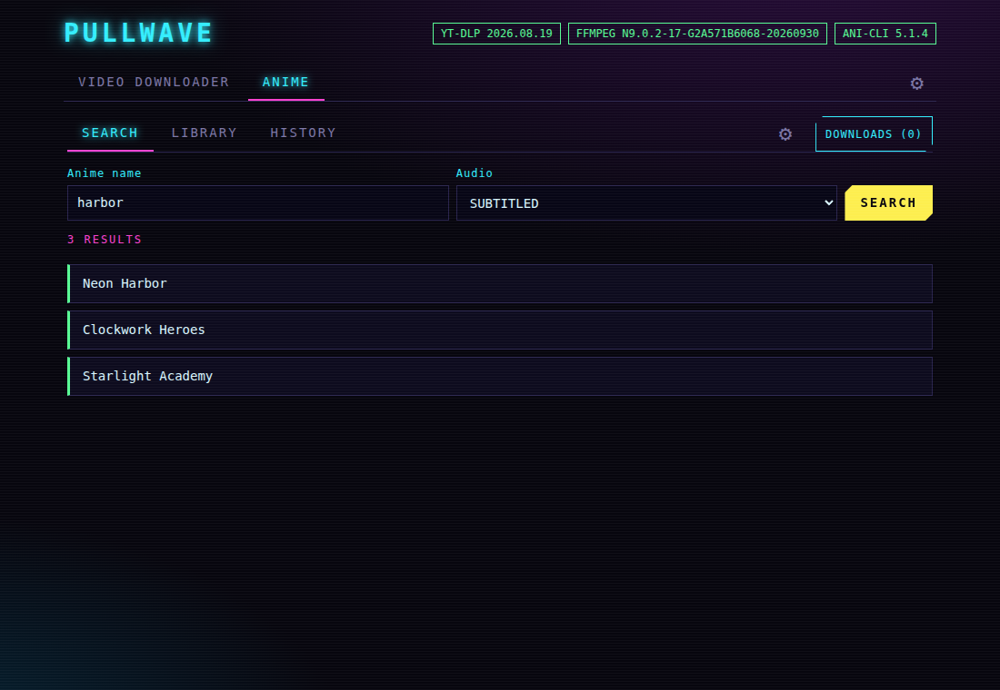
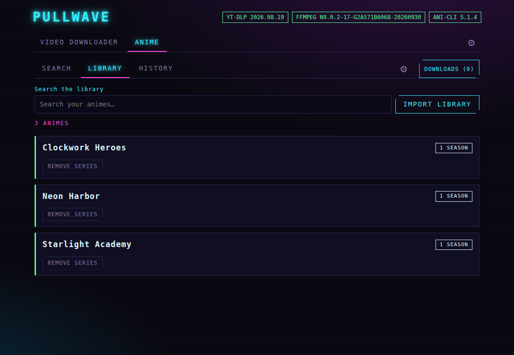
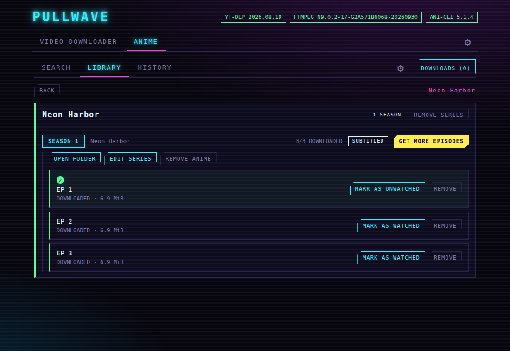
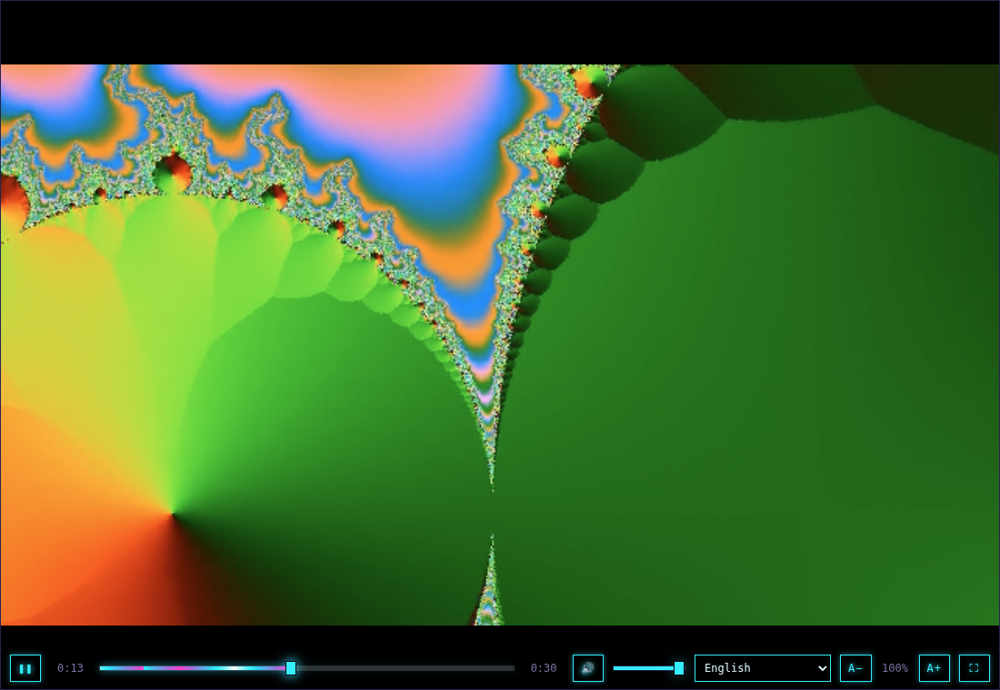

# PULLWAVE — video downloader and anime player for Linux and Windows

Pullwave is a desktop app (Electron + React + TypeScript) with a cyberpunk look, and light and dark themes too. It has two parts that live side by side:

- **Video downloader:** a graphical front end for [yt-dlp](https://github.com/yt-dlp/yt-dlp), with a queue, history, live-stream recording and a way to find the stream of a page yt-dlp does not understand.
- **Anime:** search, download, a library and a player, built on [ani-cli](https://github.com/pystardust/ani-cli). On Linux and on Windows 10 (version 1903) or newer.

Nothing else has to be installed: yt-dlp, ffmpeg, deno, ani-cli and the small tools it needs are bundled.

> **Disclaimer:** every download made with this program is **at the user's own risk and responsibility**. The authors and contributors are not responsible for what is downloaded or for how it is used. You must only download content you have the right to download. See [DISCLAIMER.md](DISCLAIMER.md).

| Cyberpunk | Dark | Light |
|---|---|---|
|  |  |  |

## Highlights
- Download videos and audio from the sites yt-dlp supports, with the quality, container and subtitles you choose, one download at a time.
- Record **live streams**, wait for scheduled ones and keep the file even when the stream drops.
- **Find stream:** when yt-dlp does not understand a page, the app looks for the video in it and lets you pick one.
- An **anime library** of your own: series and seasons, where you stopped watching, subtitles in every language the source offers, and a player inside the app.
- Watch an episode **without downloading** it.
- The whole interface in **English, Português, Español, 中文 and 日本語**.
- Settings saved as you change them, kept where they belong: the app, the video downloader and the anime section each have their own ⚙.
- Updates itself from GitHub Releases, and updates yt-dlp and ani-cli from inside the app.

## Install
Download the file for your system from the [Releases page](https://github.com/monothread/pullwave/releases/latest).

| System | File |
|---|---|
| Windows 10/11 (64-bit) | `pullwave-x.y.z-setup.exe` |
| Ubuntu, Debian and derivatives | `pullwave-x.y.z.deb` |
| Fedora (and other RPM-based distributions) | `pullwave-x.y.z.rpm` |
| Arch Linux (and derivatives) | `pullwave-x.y.z.pacman` |
| Any other Linux | `pullwave-x.y.z.AppImage` (portable, installs nothing) |

**Windows** — run the setup file. It installs for your user only and creates the shortcuts. The installer is not code-signed, so Windows SmartScreen may show "Windows protected your PC": choose *More info* → *Run anyway*.

**Ubuntu / Debian** — double-click the `.deb` or run:
```bash
sudo apt install ./pullwave-x.y.z.deb
```

**Fedora**
```bash
sudo dnf install ./pullwave-x.y.z.rpm
```

**Arch Linux**
```bash
sudo pacman -U ./pullwave-x.y.z.pacman
```

**AppImage** — browsers drop the executable permission, so enable it first:
```bash
chmod +x pullwave-x.y.z.AppImage
./pullwave-x.y.z.AppImage
```
Or right-click the file > Properties > Permissions > "Allow executing file as program", then double-click it.
- Ubuntu 22.04 and newer need FUSE 2 to run AppImages: `sudo apt install libfuse2` (`libfuse2t64` on Ubuntu 24.04). On Fedora: `sudo dnf install fuse-libs`; on Arch: `sudo pacman -S fuse2`.
- If it does not open on Ubuntu 24.04 (restricted user namespaces), run it with `--no-sandbox`. The `.deb` does not have this problem.

Once installed, the app checks for new versions by itself (the ⚙ of the top bar, APP UPDATES): one click downloads the update and another restarts into it.

## The app at a glance
The top bar has **VIDEO DOWNLOADER**, **ANIME** and a ⚙ for the settings of the whole app. Each part has its own bar with its screens and its own ⚙:

| Part | Screens |
|---|---|
| VIDEO DOWNLOADER | QUEUE · HISTORY · ⚙ |
| ANIME | SEARCH · LIBRARY · HISTORY · ⚙ (and a DOWNLOADS button) |

The back and forward buttons of the mouse move through the screens you have been to (tabs, history, an anime you opened); going back from a player closes it.

## Video downloader


### Queue
- One field per link, with **+ ADD LINK**; long links scroll inside the field. Each link also has a **FOLDER** button, to send that download to another folder, and **OPTIONS**, to choose for that download only the video quality and container, audio only and audio format, and the live-stream settings. Whatever you do not change keeps following the settings; a card downloading with custom options shows a *CUSTOM* badge.
- Progress, speed and ETA on every card, with cancel and retry. Downloads run one at a time. When one is done you get a notice and the card goes away; it stays in the history.
- A friendly error banner explains what went wrong, with the technical details one click away.
- Failed or cancelled downloads clean up their `.part` files (VIDEO DOWNLOADER > ⚙ > OUTPUT); live recordings are always kept, and each card can also clear its leftovers by hand.

### History


Every download, complete or failed, with the time and a button to show the file.

### Quality, format and subtitles
- Best video + best audio within the maximum resolution you choose; output container mp4, mkv or webm.
- Audio-only mode: mp3, m4a or opus.
- Playlists, and subtitles in the languages you choose, including YouTube's auto-generated captions. Embedded subtitles leave a single file: the separate subtitle files are removed once they are inside the video.
- A title length limit so long titles never break the file name, and an option to restrict file names to ASCII.

### Browser cookies
For age-restricted, private or members-only videos. The browsers installed on your system (and their profiles) are detected every time the app opens, including variants such as Brave Origin; use **RESCAN BROWSERS** after installing one.

### Live streams
- Record from the start (when the broadcaster still offers it), or wait for a scheduled live (the card shows a *WAITING FOR LIVE* effect).
- **STOP & SAVE** finishes the recording and keeps the file; the card shows the recording time and size.
- When a recording stops, the app keeps looking for the stream for a few seconds (10 by default, configurable; the card shows *VERIFYING END*). If the stream comes back, recording goes on in a new file of the same card.

### Find stream
When a download fails because yt-dlp does not understand the page (for example "Unsupported URL"), the card shows **FIND STREAM**. The app first scans the page's HTML, then, if nothing is found, loads the page in a hidden, sandboxed browser window for up to 25 seconds and watches which video playlists and files it requests. You choose one of the streams found and it is downloaded like any other link (with the page as referer).

- It does **not** bypass DRM: protected streams (Widevine, FairPlay...) cannot be downloaded, and pages that need a login or an action the app cannot perform may show nothing.
- The hidden window contacts the site like any browser would, so the site sees a visit from you. Nothing from it is kept after the search.
- Use it only for content you have the right to download; see [DISCLAIMER.md](DISCLAIMER.md).

### Settings of the video downloader (⚙)


OUTPUT (folder, title length, file names, partial files) · QUALITY & FORMAT · PLAYLISTS & SUBTITLES · LIVE STREAMS · BROWSER COOKIES · YT-DLP (installed version and **UPDATE YT-DLP**, which downloads the latest verified release into the app data folder) · ADVANCED (speed limit, your own yt-dlp and ffmpeg, the JavaScript runtime and extra yt-dlp arguments).

## Anime
A section for anime on top of [ani-cli](https://github.com/pystardust/ani-cli), which ships inside the app together with the small tools it needs (BusyBox and curl; BusyBox for Windows on Windows). The app never uses what is installed on the system for them. It needs Windows 10 version 1903 or newer on Windows.

### Search and download


- **Search** an anime (subtitled or dubbed). Click anywhere on a result to open it and see its episodes.
- **Download** the episodes you pick, or a whole season. The number of downloads running or waiting is the DOWNLOADS button at the top of the section; it opens the list on a screen of its own, with BACK to return.
- **Watch without downloading:** pick one episode and press WATCH.

### Library


What was downloaded, kept in a local SQLite database, with sizes, where you stopped watching and what failed. Each episode is saved in a folder of its own with its video and all its subtitles (`<series>/Season N/Episode M/`).

- The library shows one slim card per series. Click it to open the screen of the series.
- Search the library by title, open the folder of an anime, mark an episode as watched or not (it also counts as watched from 75%), and jump between the library and the search for the same anime (GET MORE EPISODES / VIEW IN LIBRARY).
- Removing an episode or an anime also deletes its files, and its folder.

### Series and seasons


The source lists every season as a separate anime. Give each one the same **series** name and its own **order** number (the app suggests them from the title; you can change them before downloading or later with EDIT SERIES), and, if you want, a **name** to show on it instead of "SEASON N". The name of the series is a search box that offers the series already in the library or keeps a new name.

On the screen of a series the seasons are in order. Click the row of a season to show or hide its episodes, and click the row of a downloaded episode to play it. Nothing is grouped by itself, and changing the series does not move files already downloaded.

### Player


A player inside the app with its own controls, in the theme: play and pause, seek (the arrow keys move 5 seconds), volume, previous and next episode, resume where you stopped, the size of the subtitles (A− / A+) and a choice of subtitle. Click the video to pause and double-click it for fullscreen. In fullscreen the controls hide after 3 seconds without moving the mouse; in the cyberpunk theme they float over the video with a neon timeline whose wave is only on the part you have already watched. Escape closes the player.

### Subtitles
- Subtitles in the language of the app (or one chosen in the ⚙ of the ANIME tab), when the source offers it. Every language the source offers is saved with a new download and can be chosen in the player.
- **CHECK SUBTITLES** asks the source again for the subtitles of the episode and saves the languages it does not have yet.
- The names of the languages are written in the language of the app ("Português (Brasil)" instead of the source's "Portuguese (- Portuguese(Brazil))").
- **LOAD SUBTITLE** adds your own `.vtt` or `.srt` file to one episode.

### History
The screen HISTORY lists the anime you opened or watched (also the ones you only searched or streamed), the most recent first, with the last episode watched. OPEN brings it back with its episodes.

### Library tools
- **IMPORT LIBRARY** rebuilds the library from a folder (after a new computer or a reinstall, or when you renamed or moved a folder). Episodes downloaded from now on keep a small `pullwave.json` next to the video and come back exactly as they were, with where you stopped watching; older ones are recognized by their names. An episode whose file is gone is marked in the library. Only folders inside the anime folder can be imported.
- **MIGRATE FOLDER** (anime settings) moves the whole library to another folder by itself: it copies the files, checks every copy, points the library and the settings to the new folder and only then removes the old files. While there is anime in the library the anime folder only changes this way.
- ani-cli's version is shown at the top, and **UPDATE ANI-CLI** in the ⚙ of the ANIME tab fetches the latest one from the project's `master` branch, only when you click it. The app checks that the file looks like ani-cli and that the shell accepts it, but ani-cli publishes no checksum for `master`, so this is trust in that repository: see the note below.

### Good to know
The episodes come from an external source that ani-cli reads; it can change or block requests at any time, and updating ani-cli is often what fixes it. ani-cli is a shell script that runs with your user's permissions: the copy that ships with the app is pinned by checksum, but **UPDATE ANI-CLI** installs whatever the `master` branch of [pystardust/ani-cli](https://github.com/pystardust/ani-cli) has at that moment, checked only for size, format and syntax, which would not catch a malicious script that is still valid. Do not use the button if you do not trust that repository; the bundled copy keeps working. Some antivirus programs distrust small unsigned tools such as BusyBox or curl; they are the official builds, pinned by checksum (see [`resources/THIRD_PARTY_NOTICES.md`](resources/THIRD_PARTY_NOTICES.md)). Some codecs may not play inside the app. The same disclaimer applies: see [DISCLAIMER.md](DISCLAIMER.md).

## Settings, themes and languages
Settings are saved automatically as you change them. The ⚙ of the top bar has the ones of the whole app:
- **Themes:** Device (follows the system light or dark mode, default), Cyberpunk, Dark and Light.
- **Languages:** Device (follows the system language, default), English, Português, Español, 中文 and 日本語. The whole interface, the messages and the tray menu change right away.
- **System tray:** optionally keep running in the tray when the window is closed (see the notes below).
- **App updates:** check for updates on startup, and the button to check now.

The ⚙ of the VIDEO DOWNLOADER tab and the ⚙ of the ANIME tab have the settings of each part. Notices stay on the screen for 5 seconds; an error stays until you dismiss it.

The interface follows the size of the window, from a half-screen window of 480 px up to a 1920x1080 screen (bigger screens are not a target): the lists take two columns when there is room and the settings flow in even columns.

## Notes
- **System tray:** on Linux the tray uses the StatusNotifierItem/AppIndicator standard (KDE, XFCE, Cinnamon, MATE, LXQt and GNOME with an extension); on Windows it is the notification area. Stock GNOME has no tray: install the "AppIndicator and KStatusNotifierItem Support" extension (Ubuntu ships it enabled; Fedora: `sudo dnf install gnome-shell-extension-appindicator`; Arch: `sudo pacman -S gnome-shell-extension-appindicator`, then enable it). Without one, the option is ignored and closing the window quits the app. Right-click the tray icon to restart or quit.
- **Windows cookies:** exporting cookies from Chrome/Edge (`--cookies-from-browser`) can fail on Windows because of the browsers' newer cookie encryption; Firefox is more reliable.
- If Electron refuses to start because of the Chromium sandbox on your distro (restricted user namespaces), run it with `--no-sandbox`.
- Third-party software bundled in the package is listed in [`resources/THIRD_PARTY_NOTICES.md`](resources/THIRD_PARTY_NOTICES.md).

## Development
Developer docs live in [`docs/`](docs/README.md); how to publish a version is in [`docs/RELEASING.md`](docs/RELEASING.md).

**Requirements**
- **Using the packaged app:** nothing else. yt-dlp, ffmpeg/ffprobe and deno are bundled, and so are ani-cli, BusyBox and a static curl.
- **Developing:** Node.js 22+. To build the Linux packages you also need `rpm` (rpmbuild), `libarchive-tools` (bsdtar) and `zstd` (`npm run check:tools` tells you what is missing). `npm run fetch-binaries` downloads the bundled binaries into `resources/bin` (checksum-verified; `npm run dist` runs it automatically); that includes ani-cli, BusyBox and curl in `resources/bin/ani`.
- You can still point to your own yt-dlp and ffmpeg in **VIDEO DOWNLOADER > ⚙ > ADVANCED**.

**Scripts**

| Command | What it does |
|---|---|
| `npm run dev` | Start the app in development mode |
| `npm run build` | Build main, preload and renderer into `out/` |
| `npm test` | Unit tests (Vitest) |
| `npm run test:e2e` | Build + end-to-end tests (Playwright driving the real Electron app with a fake yt-dlp and a fake ani-cli) |
| `npm run typecheck` | `tsc --noEmit` |
| `npm run lint` | ESLint (zero warnings allowed) |
| `npm run fetch-binaries` | Download yt-dlp, ffmpeg and deno into `resources/bin` and ani-cli + BusyBox + curl into `resources/bin/ani` (`-- --force` to refresh) |
| `npm run dist` | Linux: check the rpm/pacman tools, fetch binaries, build, and package AppImage + deb + rpm + pacman into `dist/` (never publishes) |
| `npm run dist:win` | Windows machine: same, for the NSIS installer |
| `npm run release` / `npm run release:win` | Same as `dist` / `dist:win`, then upload to a draft GitHub Release (needs `GH_TOKEN`). CI workflows do the same on GitHub; see [`docs/RELEASING.md`](docs/RELEASING.md) |
